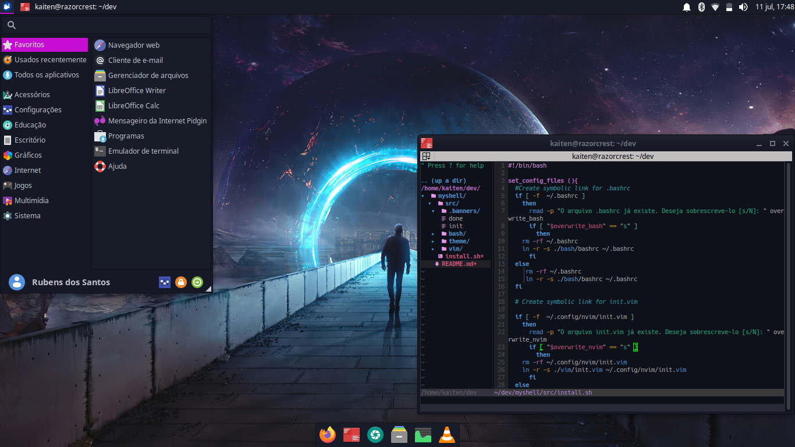

# My Shell
> _"Com organização e tempo, acha-se o segredo de fazer tudo e bem feito."_
<br> — Pitágoras

<!-- img -->
<p align="center">
  
</p>
<!-- Img -->

## Descrição

Assim como muitos devs, sofro de SMD (Sindrome da Migração Constante de Distros Linux). Caso você também sofra deste transtorno, sabe como é chato estar sempre tendo que montar todo seu ambiente toda vez que muda ou testa alguma distribuição para saciar sua curiosidade. Por isso criei esse auxiliar para montar todo o ambiente que geralmente uso, cujo foco é economizar tempo e trabalho repetitivo (DRY!!!)

## Uso

Você gosta de bolo? Vamos preparar nossa receita: o bom e velho passo-a-passo.

### Ingredientes

1. Git 
2. Ter uma distribuição linux instalada em sua máquina (Fedora ou Debian/Ubuntu e deverivados).
3. Gerenciador de pacotes **DNF** ou **APT**.
4. Terminal com **bash**
5. um copo quente e gostoso de café (opcional).

### Modo de preparo

1. Clone esse repositório.

```
git clone https://github.com/kaetaen/myshell.git
```

2. Acesse a pasta do projeto e dê permissão ao script.

```
cd myshell/src/ && sudo chmod +x install.sh
```

3. Execute o script e enquanto ele trabalha, tome o café quentinho.

```
./install.sh
```

4. Após finalizar, reinicie a máquina (não é necessário em alguns casos, mas é recomendável).

### Recheios

Existem 4 modos de instalação que podem ser definidos por flags de linha de comando, vamos conferir?


> **Sem recheio**

_Descrição:_

É o modo padrão de instalação, lançado automaticamente no momento em que o script é executado. Nesse modo são definidos **init.vim** e **.bashrc**.


> **Chocolate**

_Descrição:_

Gosta de chocolate? Nesse modo, além do modo padrão de instalação (sem recheio), são instalados os seguintes pacotes:

**Software**

* Git
* Tree
* NeoVim 
* Curl 
* PHP 
* PHPMyAdmin
* Apache 
* Composer
* NodeJS
* MySQL 
* Python3 with PIP and Virtual Enviroments 
* Terminator
* VLC Media Player
* RedShift

**Games**

* Red Eclipse 

_Comando_:

```
./install.sh --packages
```


> **Morango**

_Descrição:_

Nesse modo além de instalar o modo padrão são instalados os temas:

**Temas**

* Sweet Dark
* Dracula para o Terminator

**Icones**

* Fossa Cursores
* Papirus Dark

**Fontes**

* NERD Hack
* NERD Operator

_Comando:_

```
./install.sh --themes
```

> **Misto**

_Descrição:_

Nesse modo, são instalados tanto os arquivos de configuração como os pacotes e temas

_Comando:_

```
./install.sh --all
```
